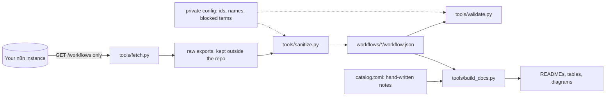

# n8n workflow library

Sixteen n8n workflows I built, sanitized so they can be shared and imported: two templates from my agency's client delivery work and fourteen prototypes built to specific automation briefs. Each workflow has its own folder with the importable `workflow.json` and a README covering what it does, the trigger, the nodes, what to configure, design notes, limitations and a flow diagram generated from its real connections.

Built by Erwin Truong, [YCAT (You Can Automate This)](https://youcanautomatethis.com).

## The problem

My real workflows run on a private n8n instance for clients and for my own agency. They contain things that must never be published: credentials, client names, email addresses, Sheet and Drive ids, the instance URL. Cleaning them by hand for a portfolio is slow and easy to get wrong. This repo is the output of a small pipeline that exports the workflows read only, sanitizes them the same way every time, and refuses to pass anything that still looks private.

## Workflows

<!-- library-table:start -->
| Workflow | Category | Trigger | Key nodes | AI | Status |
|---|---|---|---|---|---|
| [Shorts approval and publish (template)](workflows/shorts-approval-publish/) | Content ops | Webhook + Gmail | Webhook, Gmail Trigger, AI Agent (Gemini), Switch, Klap API, fal.ai VEED subtitles, YouTube | yes | production pattern |
| [YouTube long-form to Shorts (template)](workflows/longform-to-shorts/) | Content ops | Gmail + Schedule | Gmail Trigger, Schedule, YouTube, Gemini (HTTP), Klap API, Google Sheets, Gmail | yes | production pattern |
| [AI support replies from a knowledge base](workflows/support-replies-knowledge-base/) | Customer support | Gmail | Gmail Trigger, Text Classifier, Pinecone Vector Store, OpenAI, Gmail, Error Trigger | yes | prototype |
| [Vendor invoice intake and AP control (AccuLynx-ready)](workflows/invoice-intake-ap-control/) | Finance ops | Gmail + Form | Gmail Trigger, Extract from File, OpenAI, Google Sheets, Code, Google Drive, Form, Gmail | yes | prototype |
| [MCP inquiry agent, read only, with human review](workflows/mcp-inquiry-agent-human-review/) | AI agents | Webhook | Webhook, AI Agent, Anthropic Chat Model, MCP Client Tool, Structured Output Parser, Slack | yes | prototype |
| [Daily stock sync with red, amber, green alerts](workflows/stock-sync-red-amber-green/) | E-commerce ops | Schedule | Schedule, HTTP Request (Amazon SP-API, TikTok Shop, Jetpack), Code, Postgres, Slack, Gmail, Google Sheets | no | prototype |
| [Clinic call bot: outcomes to GoHighLevel and a nightly break test](workflows/clinic-call-bot-nightly-test/) | Voice AI ops | Webhook + Schedule | Webhook, IF, HTTP Request (GoHighLevel, Retell), Google Sheets, Schedule, OpenAI | yes | prototype |
| [Leads into GoHighLevel with no duplicates and no silent failures](workflows/leads-to-gohighlevel-no-duplicates/) | CRM and lead routing | Webhook + Schedule | Webhook, Set, HTTP Request (GoHighLevel), IF, Slack, Google Sheets, Schedule, Filter | no | prototype |
| [Price monitoring with Telegram and email alerts](workflows/price-monitoring-alerts/) | E-commerce monitoring | Schedule + Form | Schedule, Google Sheets, HTTP Request, Code, IF, Telegram, Gmail, Form | no | prototype |
| [New CRM customer to approved, sent proposal](workflows/crm-customer-to-proposal/) | Sales ops | Webhook | Webhook, HTTP Request, OpenAI, Google Docs, Gmail (send and wait), IF, Google Sheets | yes | prototype |
| [Process audit to automation plan](workflows/process-audit-to-automation-plan/) | Consulting ops | Form | Form, Extract from File, OpenAI, Code, IF, Google Docs, Google Sheets, Slack | yes | prototype |
| [Style quiz lead to Pipedrive deal](workflows/style-quiz-to-pipedrive/) | CRM and lead routing | Form | Form, OpenAI, IF, Pipedrive, Gmail | yes | prototype |
| [Workflow health check for GoHighLevel](workflows/workflow-health-check-gohighlevel/) | QA and monitoring | Form | Form, HTTP Request (GoHighLevel), Wait, OpenAI, IF, Google Sheets, Gmail | yes | prototype |
| [Voice agent calls into GoHighLevel with summary and recording](workflows/voice-calls-to-gohighlevel/) | Voice AI ops | Webhook | Webhook, Set, IF, OpenAI, HTTP Request (GoHighLevel), Google Sheets | yes | prototype |
| [Typeform leads into HubSpot and email segments](workflows/typeform-to-hubspot/) | CRM and lead routing | Typeform | Typeform Trigger, Code, IF, HubSpot, HTTP Request (HubSpot lists API), Gmail | no | prototype |
| [Signed DocuSign files filed in SharePoint](workflows/docusign-to-sharepoint/) | Document ops | Webhook | Webhook, IF, HTTP Request (DocuSign), Set, SharePoint, Outlook, Excel 365 | no | prototype |
<!-- library-table:end -->

Status in plain words:

- **production pattern**: a template from my agency's client delivery work; per-client copies are made from it.
- **prototype**: built to a prospect's brief to show the approach; not deployed or run against that prospect's accounts. Each README lists the gaps I know of.

## Quickstart (offline demo)

Needs Python 3.11 or newer. No packages, no account, no key.

```bash
make demo        # or: python3 demo.py
```

The demo validates all sixteen workflows and prints a summary line for each, runs the sanitizer on a fake raw export from `tests/fixtures/` and shows what it removed, and prints one generated diagram.

```bash
make validate    # the checks the library must pass (validator plus docs freshness)
make test        # pytest suite, after: pip install -r requirements.txt
```

## Import a workflow

1. In n8n, create a new workflow, open the **...** menu and choose **Import from File**, then pick `workflows/<name>/workflow.json`. Pasting the JSON onto an empty canvas works too.
2. The files carry no node ids, webhook ids or credentials; n8n assigns new ids on import, and you select your own credentials.
3. Open that workflow's README, section **What to configure**: create the listed credentials and select them in the nodes, replace the placeholders, and pick the Sheets, folders and channels that are left empty on purpose.
4. Run it once with test data before you activate it.

Placeholders come in four styles:

- `YOUR_SHEET_ID` and friends replace ids of real resources.
- `[YOUR GHL LOCATION ID]` style values are the placeholders I wrote into the prototypes.
- `N8N_BASE_URL` stands for your instance URL, in links that point back at a webhook.
- `client-slug` is the per-client token in the two templates; search and replace it per client.

## Credential checklist

No workflow ships with credentials. These are the n8n credential types you need, and where:

<!-- credentials:start -->
| Credential (n8n type) | Used by |
|---|---|
| Anthropic API | [mcp-inquiry-agent-human-review](workflows/mcp-inquiry-agent-human-review/) |
| Gmail OAuth2 | [shorts-approval-publish](workflows/shorts-approval-publish/), [longform-to-shorts](workflows/longform-to-shorts/), [support-replies-knowledge-base](workflows/support-replies-knowledge-base/), [invoice-intake-ap-control](workflows/invoice-intake-ap-control/), [stock-sync-red-amber-green](workflows/stock-sync-red-amber-green/), [price-monitoring-alerts](workflows/price-monitoring-alerts/), [crm-customer-to-proposal](workflows/crm-customer-to-proposal/), [style-quiz-to-pipedrive](workflows/style-quiz-to-pipedrive/), [workflow-health-check-gohighlevel](workflows/workflow-health-check-gohighlevel/), [typeform-to-hubspot](workflows/typeform-to-hubspot/) |
| Google Docs OAuth2 | [crm-customer-to-proposal](workflows/crm-customer-to-proposal/), [process-audit-to-automation-plan](workflows/process-audit-to-automation-plan/) |
| Google Drive OAuth2 | [invoice-intake-ap-control](workflows/invoice-intake-ap-control/) |
| Google Gemini (PaLM) API | [shorts-approval-publish](workflows/shorts-approval-publish/) |
| Google Sheets OAuth2 | [shorts-approval-publish](workflows/shorts-approval-publish/), [longform-to-shorts](workflows/longform-to-shorts/), [invoice-intake-ap-control](workflows/invoice-intake-ap-control/), [stock-sync-red-amber-green](workflows/stock-sync-red-amber-green/), [clinic-call-bot-nightly-test](workflows/clinic-call-bot-nightly-test/), [leads-to-gohighlevel-no-duplicates](workflows/leads-to-gohighlevel-no-duplicates/), [price-monitoring-alerts](workflows/price-monitoring-alerts/), [crm-customer-to-proposal](workflows/crm-customer-to-proposal/), [process-audit-to-automation-plan](workflows/process-audit-to-automation-plan/), [workflow-health-check-gohighlevel](workflows/workflow-health-check-gohighlevel/), [voice-calls-to-gohighlevel](workflows/voice-calls-to-gohighlevel/) |
| Header Auth | [shorts-approval-publish](workflows/shorts-approval-publish/), [longform-to-shorts](workflows/longform-to-shorts/), [mcp-inquiry-agent-human-review](workflows/mcp-inquiry-agent-human-review/), [crm-customer-to-proposal](workflows/crm-customer-to-proposal/), [workflow-health-check-gohighlevel](workflows/workflow-health-check-gohighlevel/), [docusign-to-sharepoint](workflows/docusign-to-sharepoint/) |
| HubSpot App Token | [typeform-to-hubspot](workflows/typeform-to-hubspot/) |
| Microsoft Excel 365 OAuth2 | [docusign-to-sharepoint](workflows/docusign-to-sharepoint/) |
| Microsoft Outlook OAuth2 | [docusign-to-sharepoint](workflows/docusign-to-sharepoint/) |
| Microsoft SharePoint OAuth2 | [docusign-to-sharepoint](workflows/docusign-to-sharepoint/) |
| OpenAI API | [support-replies-knowledge-base](workflows/support-replies-knowledge-base/), [invoice-intake-ap-control](workflows/invoice-intake-ap-control/), [clinic-call-bot-nightly-test](workflows/clinic-call-bot-nightly-test/), [crm-customer-to-proposal](workflows/crm-customer-to-proposal/), [process-audit-to-automation-plan](workflows/process-audit-to-automation-plan/), [style-quiz-to-pipedrive](workflows/style-quiz-to-pipedrive/), [workflow-health-check-gohighlevel](workflows/workflow-health-check-gohighlevel/), [voice-calls-to-gohighlevel](workflows/voice-calls-to-gohighlevel/) |
| Pinecone API | [support-replies-knowledge-base](workflows/support-replies-knowledge-base/) |
| Pipedrive API | [style-quiz-to-pipedrive](workflows/style-quiz-to-pipedrive/) |
| Postgres | [stock-sync-red-amber-green](workflows/stock-sync-red-amber-green/) |
| Slack | [mcp-inquiry-agent-human-review](workflows/mcp-inquiry-agent-human-review/), [stock-sync-red-amber-green](workflows/stock-sync-red-amber-green/), [leads-to-gohighlevel-no-duplicates](workflows/leads-to-gohighlevel-no-duplicates/), [process-audit-to-automation-plan](workflows/process-audit-to-automation-plan/) |
| Telegram API | [price-monitoring-alerts](workflows/price-monitoring-alerts/) |
| Typeform API | [typeform-to-hubspot](workflows/typeform-to-hubspot/) |
| YouTube OAuth2 | [shorts-approval-publish](workflows/shorts-approval-publish/), [longform-to-shorts](workflows/longform-to-shorts/) |
<!-- credentials:end -->

Several prototypes call GoHighLevel, Retell, Amazon, TikTok Shop and Jetpack through HTTP Request nodes with the token as a header placeholder, for example `Bearer [YOUR GHL PRIVATE INTEGRATION TOKEN]`. Move those tokens into a Header Auth credential before you go live.

## How the library is built



- **`tools/fetch.py`** talks to the n8n public API with `GET` only (`/workflows` with cursor pagination, `/workflows/<id>`). It never prints the API key or the base URL.
- **`tools/sanitize.py`** keeps only what n8n needs to import a workflow and rewrites everything private. Same input, byte-identical output.
- **`tools/validate.py`** is the gate. It shares its patterns with the sanitizer and adds structural checks and a host allowlist.
- **`tools/build_docs.py`** writes the per-workflow READMEs and the tables above from `catalog.toml` plus facts computed from the JSON.

What the sanitizer removes or rewrites, in order:

1. Top level: keeps `name`, `nodes`, `connections` and an allowlist of `settings`. Drops `id`, `versionId`, `meta`, `pinData`, `staticData`, `tags`, sharing, history and the error workflow id.
2. Nodes: keeps an allowlist of keys. Drops node `id`, `webhookId` and every `credentials` block.
3. Resource locators: real Sheet, Doc, Drive, workflow and channel ids become `YOUR_SHEET_ID` style placeholders; cached URLs and names of those resources are dropped.
4. HTTP header, query and body parameters with secret-like names get `YOUR_API_KEY` unless they already hold an expression or a placeholder.
5. Webhook and form paths that are UUIDs become readable slugs.
6. Text rules on every string, dict keys included, so a renamed node stays consistent with `connections` and with `$('Node')` references: config replacements (names, phrases), instance URL to `N8N_BASE_URL`, `CLIENTSLUG` to `client-slug`, emails to `example.com`, phone numbers, Google ids, YouTube channel ids, secret patterns (OpenAI, Google, Slack, GitHub, JWT, bearer tokens), em and en dashes.

The validator then checks every file: allowlisted keys only, unique node names, every connection source and target exists, every `$('Node')` reference resolves, no real emails, phone numbers, ids, UUIDs or secrets, every URL host on the allowlist, and the blocked terms from your private config.

## Real mode: export and sanitize your own workflows

1. `cp .env.example .env` and fill `N8N_BASE_URL` and `N8N_API_KEY` (n8n: Settings > n8n API).
2. `pip install -r requirements.txt`
3. `python3 tools/fetch.py --list` shows id, name, tags and node count of every workflow.
4. Copy `sanitize.config.example.json` to a folder **outside** the repo and fill it: the workflow ids and slugs, the names and phrases to replace, and the terms that must never appear.
5. Export, sanitize, document and check in one go:

```bash
make refresh CONFIG=/path/outside/repo/config.json RAW=/tmp/n8n-raw
```

That runs `fetch.py --manifest`, `sanitize.py`, `build_docs.py` and `validate.py --config` in order. Add `ENV_FILE=/path/to/.env` when your key lives in another `.env`. A new slug also needs an entry in `catalog.toml`.

## Project layout

```text
catalog.toml                    hand-written notes per workflow (feeds the READMEs)
workflows/<slug>/workflow.json  sanitized, importable workflow
workflows/<slug>/README.md      generated: what it does, trigger, diagram, configuration
tools/fetch.py                  GET-only export from your n8n instance
tools/sanitize.py               deterministic sanitizer
tools/validate.py               the gate: structure, references, leaks
tools/build_docs.py             READMEs, tables and diagrams from the JSON
tools/n8nlib.py                 shared helpers (stdlib only)
demo.py                         offline demo
sanitize.config.example.json    shape of the private config, with fictional values
tests/                          pytest suite and a fake raw export fixture
```

## Design decisions

- **Allowlists for structure, patterns for text.** A sanitized workflow keeps only the keys n8n needs to import it, so a new field in a future n8n export is dropped by default instead of leaking.
- **Rules run on dict keys too.** Node names are keys in `connections` and strings inside expressions; renaming them everywhere at once keeps the workflow wired.
- **Private terms stay out of the repo.** The sanitizer and validator read names and ids to remove from a config file kept elsewhere. The repo itself only holds generic patterns.
- **One set of patterns.** The validator imports the sanitizer's patterns, so the two can never disagree about what counts as an email, an id or a secret.
- **Docs computed from the JSON.** Diagrams come from the real connections, credential lists from node types and auth settings, placeholder lists from the parameters. Only the narrative is hand-written.
- **Deterministic output.** Same raw export and config, byte-identical files, so a re-run after a fresh export shows a clean diff.

## Limitations

- The files are checked structurally (valid JSON, consistent connections and references, allowlisted keys), not imported into every n8n version. They were exported from a recent n8n, and older versions may not know every node `typeVersion`.
- The prototypes were built to show an approach and were not run against live accounts. Their READMEs list the gaps I know of.
- Required credentials are derived from node types and auth settings, not from the original credential records, which are never exported.
- The sanitizer catches known patterns. A person or company name in free text is only replaced when it is in your config, which is why the validator checks your blocked terms as well.

## License

MIT, see [LICENSE](LICENSE).
