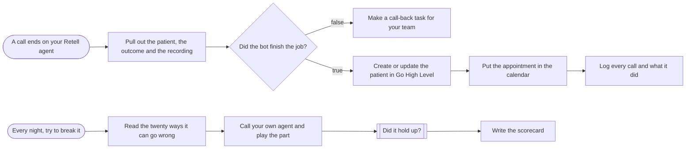

# Clinic call bot: outcomes to GoHighLevel and a nightly break test

**Category:** Voice AI ops | **Status:** prototype | **AI:** yes | **Nodes:** 12 plus 2 sticky notes

> Prototype: built to a prospect's brief to show the approach; not deployed or run against that prospect's accounts.

After each Retell call, bookings go into GoHighLevel and its calendar and stuck calls become call-backs; every night scripted test calls are graded into a scorecard.

## What it does

Two parts.

1. **After every call.** Retell's call-analyzed webhook arrives and a Set node pulls out call id, phone, duration, summary, booking flag, slot, patient name, escalation reason, recording and transcript. A call only counts as done when the bot booked, with a slot and a name. Then the contact is upserted in GoHighLevel on the phone number, the appointment is created in the clinic calendar, and the call is logged to a sheet. Any other call upserts the contact with call-back tags, the reason, the summary and the recording, so a person follows up.
2. **Every night.** Test scripts are read from a sheet (scenario, what the caller does, what should happen). For each one, Retell places a test call from a test-caller agent to the clinic agent with the script as dynamic variables, OpenAI grades the transcript strictly against the expected behaviour, and the verdict goes to a scorecard tab.

## Trigger

- `A call ends on your Retell agent`: Webhook, POST /webhook/retell-call-analyzed
- `Every night, try to break it`: Schedule (every day at 02:00)

## Flow

Rounded boxes are triggers, diamonds are decisions, double boxes are AI steps, dotted lines attach a model, tool or parser to an AI node.

## Key nodes

Webhook, IF, HTTP Request (GoHighLevel, Retell), Google Sheets, Schedule, OpenAI

## What to configure

1. Import `workflow.json` (see [How to import](../../README.md#import-a-workflow)).
2. Create these credentials in n8n and select them in the listed nodes:

   - **Google Sheets OAuth2**: `Log every call and what it did`, `Read the twenty ways it can go wrong`, `Write the scorecard`
   - **OpenAI API**: `Did it hold up?`

3. Replace or fill in these placeholders (some mark an edit spot inside a Code node):

   - `[TEST CALLER AGENT ID]` in `Call your own agent and play the part`
   - `[YOUR CLINIC AGENT NUMBER]` in `Call your own agent and play the part`
   - `[YOUR CLINIC CALENDAR ID]` in `Put the appointment in the calendar`
   - `[YOUR GHL LOCATION ID]` in `Make a call-back task for your team`, `Create or update the patient in Go High Level`, `Put the appointment in the calendar`
   - `[YOUR GHL PRIVATE INTEGRATION TOKEN]` in `Make a call-back task for your team`, `Create or update the patient in Go High Level`, `Put the appointment in the calendar`
   - `[YOUR RETELL API KEY]` in `Call your own agent and play the part`
   - `[YOUR TEST NUMBER]` in `Call your own agent and play the part`

4. Pick these resources in the node (left empty on purpose):

   - `Log every call and what it did`: documentId, shown as "Call bot log (pick your sheet)"
   - `Log every call and what it did`: sheetName, shown as "Live calls"
   - `Read the twenty ways it can go wrong`: documentId, shown as "Call bot log (pick your sheet)"
   - `Read the twenty ways it can go wrong`: sheetName, shown as "Break tests"
   - `Write the scorecard`: documentId, shown as "Call bot log (pick your sheet)"
   - `Write the scorecard`: sheetName, shown as "Scorecard"

5. Create the GoHighLevel custom fields the payloads use: call_id, stuck_reason, call_recording, call_summary.

6. Prepare the call bot sheet with three tabs: Live calls, Break tests (scenario, what_the_caller_does, what_should_happen) and Scorecard.

## Design notes

- A booking counts only with all three: the booked flag, a real slot and a name. Anything less becomes a call-back, because a booking made on a guess costs more than a missed one.
- Contacts are upserted on the phone number, so a retried webhook does not create a second contact.
- The test suite lives in a sheet, so staff can add a failure case without touching the workflow, and every prompt change is re-tested the same way.
- The grading prompt lists hard fails: an invented price, clinical advice, claiming to be human, booking without confirming the slot, hanging up on a silent caller.

## Limitations

- The nightly grader reads the transcript from the create-phone-call response, which returns before the call has happened. Add a wait and a get-call step (or route the call-analyzed webhook) before grading.
- Only booked calls are logged to the Live calls tab; the call-back branch ends at GoHighLevel.
- GoHighLevel and Retell keys are header placeholders. A Header Auth credential is the better home.

All 12 nodes

| Node | Type |
|---|---|
| A call ends on your Retell agent | `n8n-nodes-base.webhook` v2 |
| Pull out the patient, the outcome and the recording | `n8n-nodes-base.set` v3.4 |
| Did the bot finish the job? | `n8n-nodes-base.if` v2.2 |
| Make a call-back task for your team | `n8n-nodes-base.httpRequest` v4.2 |
| Create or update the patient in Go High Level | `n8n-nodes-base.httpRequest` v4.2 |
| Put the appointment in the calendar | `n8n-nodes-base.httpRequest` v4.2 |
| Log every call and what it did | `n8n-nodes-base.googleSheets` v4.5 |
| Every night, try to break it | `n8n-nodes-base.scheduleTrigger` v1.2 |
| Read the twenty ways it can go wrong | `n8n-nodes-base.googleSheets` v4.5 |
| Call your own agent and play the part | `n8n-nodes-base.httpRequest` v4.2 |
| Did it hold up? | `@n8n/n8n-nodes-langchain.openAi` v1.8 |
| Write the scorecard | `n8n-nodes-base.googleSheets` v4.5 |

