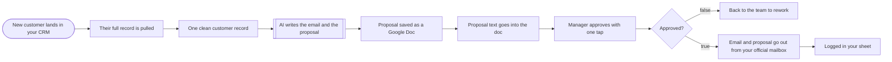

# New CRM customer to approved, sent proposal

**Category:** Sales ops | **Status:** prototype | **AI:** yes | **Nodes:** 11 plus 2 sticky notes

> Prototype: built to a prospect's brief to show the approach; not deployed or run against that prospect's accounts.

A new CRM record triggers an AI-written email and proposal in Google Docs; a manager approves by email before it goes out from the official mailbox.

## What it does

The CRM calls a webhook when a customer record is created. The workflow fetches the full record from the CRM API, flattens it (name, company, occasion, dates, guests, budget, notes) and asks OpenAI for one JSON object with the email subject, the email body and the proposal text, written for a hospitality business from your packages and past proposals, with `[CONFIRM]` wherever a number is missing. The proposal becomes a Google Doc. A manager gets the draft through Gmail send-and-wait with approve and decline buttons, and the execution pauses until someone clicks. Approved: the email and the doc link go to the customer from the official mailbox and the send is logged to a sheet. Declined: the draft goes back to the sales team.

## Trigger

- `New customer lands in your CRM`: Webhook, POST /webhook/new-customer

## Flow

Rounded boxes are triggers, diamonds are decisions, double boxes are AI steps, dotted lines attach a model, tool or parser to an AI node.

## Key nodes

Webhook, HTTP Request, OpenAI, Google Docs, Gmail (send and wait), IF, Google Sheets

## What to configure

1. Import `workflow.json` (see [How to import](../../README.md#import-a-workflow)).
2. Create these credentials in n8n and select them in the listed nodes:

   - **Gmail OAuth2**: `Manager approves with one tap`, `Back to the team to rework`, `Email and proposal go out from your official mailbox`
   - **Google Docs OAuth2**: `Proposal saved as a Google Doc`, `Proposal text goes into the doc`
   - **Google Sheets OAuth2**: `Logged in your sheet`
   - **Header Auth for [your**: `Their full record is pulled`
   - **OpenAI API**: `AI writes the email and the proposal`

3. Replace or fill in these placeholders (some mark an edit spot inside a Code node):

   - `[EXAMPLE 1]` in `AI writes the email and the proposal`
   - `[PACKAGE 1]` in `AI writes the email and the proposal`
   - `[PACKAGE 2]` in `AI writes the email and the proposal`
   - `[PROPOSALS FOLDER ID]` in `Proposal saved as a Google Doc`
   - `[SHEET ID]` in `Logged in your sheet`
   - `[YOUR CRM API BASE]` in `Their full record is pulled`

4. Paste your packages, rates and a few past proposals into the system prompt of `AI writes the email and the proposal`.

5. Map the record fields in `One clean customer record` to your CRM's field names.

## Design notes

- Human approval without extra tooling: Gmail send-and-wait with a double approval button pauses the execution until the manager decides.
- Missing numbers are marked `[CONFIRM]` instead of invented.
- The CRM is reached through one webhook and one HTTP call, so HubSpot, Pipedrive or Zoho is the same swap.

## Limitations

- The proposal doc is created by title and the text is appended once. There is no house template or formatting step.

All 11 nodes

| Node | Type |
|---|---|
| New customer lands in your CRM | `n8n-nodes-base.webhook` v2 |
| Their full record is pulled | `n8n-nodes-base.httpRequest` v4.2 |
| One clean customer record | `n8n-nodes-base.set` v3.4 |
| AI writes the email and the proposal | `@n8n/n8n-nodes-langchain.openAi` v1.8 |
| Proposal saved as a Google Doc | `n8n-nodes-base.googleDocs` v2 |
| Proposal text goes into the doc | `n8n-nodes-base.googleDocs` v2 |
| Manager approves with one tap | `n8n-nodes-base.gmail` v2.1 |
| Approved? | `n8n-nodes-base.if` v2.2 |
| Back to the team to rework | `n8n-nodes-base.gmail` v2.1 |
| Email and proposal go out from your official mailbox | `n8n-nodes-base.gmail` v2.1 |
| Logged in your sheet | `n8n-nodes-base.googleSheets` v4.5 |

