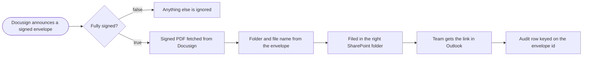

# Signed DocuSign files filed in SharePoint

**Category:** Document ops | **Status:** prototype | **AI:** no | **Nodes:** 8 plus 2 sticky notes

> Prototype: built to a prospect's brief to show the approach; not deployed or run against that prospect's accounts.

DocuSign Connect posts completed envelopes; the signed PDF is fetched, named, uploaded to SharePoint, announced in Outlook and logged in Excel keyed on the envelope id.

## What it does

DocuSign Connect calls a webhook on envelope events. Only `envelope-completed` goes on; sent, viewed and declined events end in a No-op. The combined signed document is downloaded from the DocuSign eSignature API, a Set node builds the file name from the date, the email subject and the start of the envelope id (plus a year folder name), the PDF is uploaded to SharePoint, the team gets the SharePoint link in Outlook, and an Excel 365 log row is upserted on the envelope id.

## Trigger

- `Docusign announces a signed envelope`: Webhook, POST /webhook/docusign-completed

## Flow

Rounded boxes are triggers, diamonds are decisions, double boxes are AI steps, dotted lines attach a model, tool or parser to an AI node.

## Key nodes

Webhook, IF, HTTP Request (DocuSign), Set, SharePoint, Outlook, Excel 365

## What to configure

1. Import `workflow.json` (see [How to import](../../README.md#import-a-workflow)).
2. Create these credentials in n8n and select them in the listed nodes:

   - **Header Auth for [account**: `Signed PDF fetched from Docusign`
   - **Microsoft Excel 365 OAuth2**: `Audit row keyed on the envelope id`
   - **Microsoft Outlook OAuth2**: `Team gets the link in Outlook`
   - **Microsoft SharePoint OAuth2**: `Filed in the right SharePoint folder`

3. Replace or fill in these placeholders (some mark an edit spot inside a Code node):

   - `[ACCOUNT BASE]` in `Signed PDF fetched from Docusign`
   - `[ACCOUNT ID]` in `Signed PDF fetched from Docusign`
   - `[CONTRACTS TEAM EMAIL]` in `Team gets the link in Outlook`

4. Pick these resources in the node (left empty on purpose):

   - `Filed in the right SharePoint folder`: site, shown as "Contracts (pick your site)"
   - `Audit row keyed on the envelope id`: workbook, shown as "Signed agreements log (pick the workbook)"
   - `Audit row keyed on the envelope id`: worksheet, shown as "Log"

5. Point DocuSign Connect at the webhook URL, and give the DocuSign Header Auth credential an access token.

## Design notes

- Filter on the completed event first, so drafts and partial signings never create files.
- The audit log is an upsert on the envelope id, so a repeated DocuSign delivery overwrites its row instead of adding a duplicate.
- If the DocuSign plan includes the native SharePoint connector, the sticky note says to switch that on instead of building this.

## Limitations

- The computed year folder is not passed to the SharePoint upload yet. Pick the site, library and folder in the node.

All 8 nodes

| Node | Type |
|---|---|
| Docusign announces a signed envelope | `n8n-nodes-base.webhook` v2 |
| Fully signed? | `n8n-nodes-base.if` v2.2 |
| Anything else is ignored | `n8n-nodes-base.noOp` v1 |
| Signed PDF fetched from Docusign | `n8n-nodes-base.httpRequest` v4.2 |
| Folder and file name from the envelope | `n8n-nodes-base.set` v3.4 |
| Filed in the right SharePoint folder | `n8n-nodes-base.microsoftSharePoint` v1 |
| Team gets the link in Outlook | `n8n-nodes-base.microsoftOutlook` v2 |
| Audit row keyed on the envelope id | `n8n-nodes-base.microsoftExcel` v2.1 |

