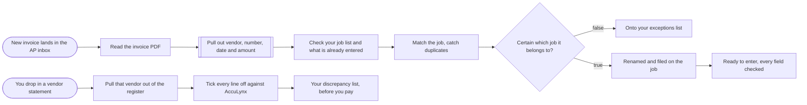

# Vendor invoice intake and AP control (AccuLynx-ready)

**Category:** Finance ops | **Status:** prototype | **AI:** yes | **Nodes:** 13 plus 2 sticky notes

> Prototype: built to a prospect's brief to show the approach; not deployed or run against that prospect's accounts.

Invoice PDFs from an AP inbox are read, matched to a job, checked for duplicates and filed; a form reconciles vendor statements line by line before payment.

## What it does

Two parts.

1. **Intake.** A Gmail trigger picks up mail with attachments (out-of-office replies excluded) and the PDF text is extracted. OpenAI pulls out vendor, invoice number, date, amount, a credit flag and any job reference, and returns empty fields instead of guesses. A Code node reads the job list and the invoice register from a Google Sheet: duplicates are caught on vendor plus invoice number (and on vendor, amount and date for vendors that reuse numbers), and the job is matched on name, address, PO or claim number. Only confident matches are renamed, filed to Google Drive and added to the register; everything else goes to an exceptions tab with the reason.
2. **Statement check.** An n8n form takes a vendor statement, one line per invoice. A Code node ticks every line off against the register and reports missing invoices and credits, duplicates, wrong amounts, invoices without a job, and a statement total that does not add up. The list is emailed before anyone pays.

AccuLynx itself is not called. The Google Sheet stands in for the AccuLynx job list and invoice register, and the register rows are ready to be entered.

## Trigger

- `New invoice lands in the AP inbox`: Gmail (polls every minute, query: has:attachment -subject:("out of office") -subject:("automatic reply"))
- `You drop in a vendor statement`: Form (n8n hosted form, 'Vendor statement check')

## Flow

Rounded boxes are triggers, diamonds are decisions, double boxes are AI steps, dotted lines attach a model, tool or parser to an AI node.

## Key nodes

Gmail Trigger, Extract from File, OpenAI, Google Sheets, Code, Google Drive, Form, Gmail

## What to configure

1. Import `workflow.json` (see [How to import](../../README.md#import-a-workflow)).
2. Create these credentials in n8n and select them in the listed nodes:

   - **Gmail OAuth2**: `New invoice lands in the AP inbox`, `Your discrepancy list, before you pay`
   - **Google Drive OAuth2**: `Renamed and filed on the job`
   - **Google Sheets OAuth2**: `Check your job list and what is already entered`, `Onto your exceptions list`, `Ready to enter, every field checked`, `Pull that vendor out of the register`
   - **OpenAI API**: `Pull out vendor, number, date and amount`

3. Replace or fill in these placeholders (some mark an edit spot inside a Code node):

   - `[PLACEHOLDER: your AP manager]` in `Your discrepancy list, before you pay`
   - `[PLACEHOLDER]` in `Match the job, catch duplicates`

4. Pick these resources in the node (left empty on purpose):

   - `Check your job list and what is already entered`: documentId, shown as "AP control sheet (pick your sheet)"
   - `Check your job list and what is already entered`: sheetName, shown as "Jobs and invoices"
   - `Onto your exceptions list`: documentId, shown as "AP control sheet (pick your sheet)"
   - `Onto your exceptions list`: sheetName, shown as "Exceptions"
   - `Renamed and filed on the job`: folderId, shown as "Job files (pick your folder)"
   - `Ready to enter, every field checked`: documentId, shown as "AP control sheet (pick your sheet)"
   - `Ready to enter, every field checked`: sheetName, shown as "Invoice register"
   - `Pull that vendor out of the register`: documentId, shown as "AP control sheet (pick your sheet)"
   - `Pull that vendor out of the register`: sheetName, shown as "Invoice register"

5. Prepare the AP control sheet with a `Type` column (job or invoice) and the columns the code reads: JobID, JobName, Address, PONumber, ClaimNumber, Vendor, InvoiceNumber, InvoiceDate, Amount.

6. Set your file naming convention in `Match the job, catch duplicates` (marked `[PLACEHOLDER]`).

## Design notes

- The model only reads the document. Matching, duplicate checks and reconciliation are plain code, so the same input always gives the same answer.
- Confidence gate: a job match needs a long enough identifier and a model confidence of at least 0.7, otherwise the invoice goes to exceptions with a written reason. Nothing is guessed.
- The statement check is read only and says so in the email it sends.

## Limitations

- AccuLynx is not called. Wiring its API depends on the plan's API access (noted in the sticky).
- Only the first attachment (`attachment_0`) is read, and scanned PDFs without a text layer need an OCR step first.

All 13 nodes

| Node | Type |
|---|---|
| New invoice lands in the AP inbox | `n8n-nodes-base.gmailTrigger` v1.2 |
| Read the invoice PDF | `n8n-nodes-base.extractFromFile` v1 |
| Pull out vendor, number, date and amount | `@n8n/n8n-nodes-langchain.openAi` v1.8 |
| Check your job list and what is already entered | `n8n-nodes-base.googleSheets` v4.5 |
| Match the job, catch duplicates | `n8n-nodes-base.code` v2 |
| Certain which job it belongs to? | `n8n-nodes-base.if` v2.2 |
| Onto your exceptions list | `n8n-nodes-base.googleSheets` v4.5 |
| Renamed and filed on the job | `n8n-nodes-base.googleDrive` v3 |
| Ready to enter, every field checked | `n8n-nodes-base.googleSheets` v4.5 |
| You drop in a vendor statement | `n8n-nodes-base.formTrigger` v2.4 |
| Pull that vendor out of the register | `n8n-nodes-base.googleSheets` v4.5 |
| Tick every line off against AccuLynx | `n8n-nodes-base.code` v2 |
| Your discrepancy list, before you pay | `n8n-nodes-base.gmail` v2.1 |

