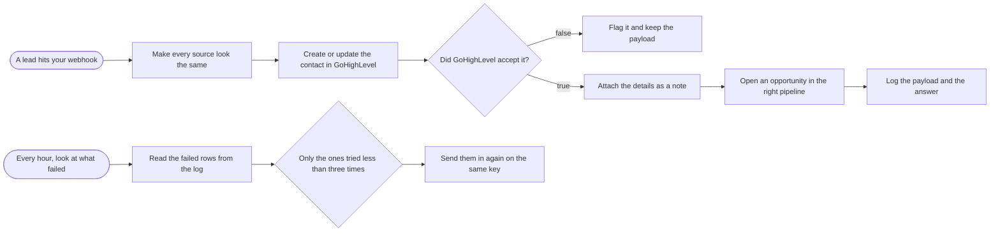

# Leads into GoHighLevel with no duplicates and no silent failures

**Category:** CRM and lead routing | **Status:** prototype | **AI:** no | **Nodes:** 12 plus 2 sticky notes

> Prototype: built to a prospect's brief to show the approach; not deployed or run against that prospect's accounts.

One webhook for every lead source: payloads are normalised, upserted into GoHighLevel, noted and opened as opportunities, with refusals flagged in Slack and an hourly replay.

## What it does

A webhook takes leads from forms, Zapier or any other system. A Set node maps the different payload shapes onto one (email, phone, first and last name, source) and builds a stable dedupe key from the source's own id, or from email plus source. The contact is upserted in GoHighLevel. If GoHighLevel accepts it, the raw payload is attached as a note, an opportunity opens in the new-lead stage, and the payload plus response are logged to a sheet. If it refuses, Slack gets the status code, the reason and the lead. A second branch runs every hour, reads a Failed tab, keeps rows tried fewer than three times and sends them to the upsert endpoint again.

## Trigger

- `A lead hits your webhook`: Webhook, POST /webhook/lead-in
- `Every hour, look at what failed`: Schedule (every hour)

## Flow

Rounded boxes are triggers, diamonds are decisions, double boxes are AI steps, dotted lines attach a model, tool or parser to an AI node.

## Key nodes

Webhook, Set, HTTP Request (GoHighLevel), IF, Slack, Google Sheets, Schedule, Filter

## What to configure

1. Import `workflow.json` (see [How to import](../../README.md#import-a-workflow)).
2. Create these credentials in n8n and select them in the listed nodes:

   - **Google Sheets OAuth2**: `Log the payload and the answer`, `Read the failed rows from the log`
   - **Slack**: `Flag it and keep the payload`

3. Replace or fill in these placeholders (some mark an edit spot inside a Code node):

   - `[NEW LEAD STAGE ID]` in `Open an opportunity in the right pipeline`
   - `[YOUR GHL LOCATION ID]` in `Create or update the contact in GoHighLevel`, `Open an opportunity in the right pipeline`
   - `[YOUR GHL PRIVATE INTEGRATION TOKEN]` in `Create or update the contact in GoHighLevel`, `Attach the details as a note`, `Open an opportunity in the right pipeline`, `Send them in again on the same key`
   - `[YOUR GHL USER ID]` in `Attach the details as a note`
   - `[YOUR PIPELINE ID]` in `Open an opportunity in the right pipeline`

4. Pick these resources in the node (left empty on purpose):

   - `Log the payload and the answer`: documentId, shown as "Integration log (pick your sheet)"
   - `Log the payload and the answer`: sheetName, shown as "Leads"
   - `Read the failed rows from the log`: documentId, shown as "Integration log (pick your sheet)"
   - `Read the failed rows from the log`: sheetName, shown as "Failed"

5. Create a `dedupe_key` custom field in GoHighLevel and the Leads and Failed tabs in the log sheet.

## Design notes

- Upsert instead of create, so GoHighLevel matches an existing contact by email or phone and a retried webhook does not add a second one. The dedupe key is stored on the contact too.
- `neverError` plus `fullResponse` on the upsert: the IF node reads the real status code and contact id instead of the workflow stopping on a 4xx.
- The original payload is kept twice, as a note on the contact and in the log, because debugging an integration without it is guesswork.

## Limitations

- Nothing writes to the Failed tab yet. The refusal branch only posts to Slack, although its message says the lead is on the Failed tab. One Google Sheets append closes the loop.
- The replay never increments the attempts column, and it re-sends the stored payload as is. Map it through the same shape as the live path first.
- The GoHighLevel token is a header placeholder. A Header Auth credential is the better home.

All 12 nodes

| Node | Type |
|---|---|
| A lead hits your webhook | `n8n-nodes-base.webhook` v2 |
| Make every source look the same | `n8n-nodes-base.set` v3.4 |
| Create or update the contact in GoHighLevel | `n8n-nodes-base.httpRequest` v4.2 |
| Did GoHighLevel accept it? | `n8n-nodes-base.if` v2.2 |
| Flag it and keep the payload | `n8n-nodes-base.slack` v2.3 |
| Attach the details as a note | `n8n-nodes-base.httpRequest` v4.2 |
| Open an opportunity in the right pipeline | `n8n-nodes-base.httpRequest` v4.2 |
| Log the payload and the answer | `n8n-nodes-base.googleSheets` v4.5 |
| Every hour, look at what failed | `n8n-nodes-base.scheduleTrigger` v1.2 |
| Read the failed rows from the log | `n8n-nodes-base.googleSheets` v4.5 |
| Only the ones tried less than three times | `n8n-nodes-base.filter` v2 |
| Send them in again on the same key | `n8n-nodes-base.httpRequest` v4.2 |

