# YouTube long-form to Shorts (template)

**Category:** Content ops | **Status:** production pattern | **AI:** yes | **Nodes:** 23 plus 2 sticky notes

> Production pattern: a template from my agency's client delivery work; per-client copies are made from it.

A new long-form video (sent by the client or found on their channel) is cut into Shorts by Klap, logged, and sent to the client as a review email with approve, regenerate and skip links.

## What it does

The first half of the client Shorts pipeline. Three entry points feed one path:

- the client emails a YouTube link to a shared inbox; a Gmail label per client routes it to this copy, and an IF node checks the sender again,
- an hourly schedule lists the client's channel for uploads from the last two hours, with a dedupe step so a video is cut once,
- a manual trigger with a test URL.

Every request is logged to a tracking sheet. Email requests go to Gemini, which turns free text ("five clips, under 45 seconds, no emoji") into Klap settings through a JSON schema; the other sources get defaults. Klap cuts the video, the workflow polls until the task is ready, logs every clip with its virality score, and emails the client one HTML card per clip with Approve, Regenerate and Skip links that point at the [Shorts approval template](../shorts-approval-publish/).

## Trigger

- `Manual Trigger (testing)`: Manual (test)
- `Gmail: Client Inbound (label:client:client-slug)`: Gmail (polls every minute, query: label:client:client-slug to:shorts@example.com (youtube.com OR youtu.be))
- `Schedule (every 1h)`: Schedule (every hour)

## Flow

```mermaid
flowchart LR
  n1(["Manual Trigger (testing)"])
  n2["Test Input (paste YT URL)"]
  n3(["Gmail: Client Inbound (label:client:client-slug)"])
  n4{"Verify Sender (REPLACE per client)"}
  n5["Extract from Email"]
  n6(["Schedule (every 1h)"])
  n7["YouTube: Get Latest from CLIENT Channel"]
  n8["Extract from Schedule"]
  n9["Log Incoming → Sheet (YCAT)"]
  n10{"IF: Source = Email?"}
  n11["Gemini Parse Intent"]
  n12["Parse Gemini JSON"]
  n13["Apply Klap Defaults (non-email)"]
  n14["Klap: Submit Task"]
  n15["Wait 1 min"]
  n16["Klap: Get Status"]
  n17{"IF: Klap Status Ready?"}
  n18["Klap: Get Shorts"]
  n19["Log Shorts → Sheet (YCAT)"]
  n20["Aggregate Clips for Email"]
  n21["Render Clip List HTML"]
  n22["Notify Client → Review (Gmail)"]
  n23["Dedupe: Skip Already-Seen Videos"]
  n1 --> n2
  n2 --> n9
  n3 --> n4
  n4 -->|true| n5
  n5 --> n9
  n6 --> n7
  n7 --> n8
  n8 --> n23
  n9 --> n10
  n10 -->|true| n11
  n10 -->|false| n13
  n11 --> n12
  n12 --> n14
  n13 --> n14
  n14 --> n15
  n15 --> n16
  n16 --> n17
  n17 -->|true| n18
  n17 -->|false| n15
  n18 --> n19
  n19 --> n20
  n20 --> n21
  n21 --> n22
  n23 --> n9
```

Rounded boxes are triggers, diamonds are decisions, double boxes are AI steps, dotted lines attach a model, tool or parser to an AI node.

## Key nodes

Gmail Trigger, Schedule, YouTube, Gemini (HTTP), Klap API, Google Sheets, Gmail

## What to configure

1. Import `workflow.json` (see [How to import](../../README.md#import-a-workflow)).
2. Create these credentials in n8n and select them in the listed nodes:

   - **Gmail OAuth2**: `Gmail: Client Inbound (label:client:client-slug)`, `Notify Client → Review (Gmail)`
   - **Google Sheets OAuth2**: `Log Incoming → Sheet (YCAT)`, `Log Shorts → Sheet (YCAT)`
   - **Header Auth for api.klap.app**: `Klap: Submit Task`, `Klap: Get Status`, `Klap: Get Shorts`
   - **Header Auth for generativelanguage.googleapis.com**: `Gemini Parse Intent`
   - **YouTube OAuth2**: `YouTube: Get Latest from CLIENT Channel`

3. Replace or fill in these placeholders (some mark an edit spot inside a Code node):

   - `client-slug` in `Gmail: Client Inbound (label:client:client-slug)`, `Render Clip List HTML`, `Notify Client → Review (Gmail)`
   - `N8N_BASE_URL` in `Render Clip List HTML`
   - `REPLACE_WITH_CLIENT_EMAIL` in `Verify Sender (REPLACE per client)`, `Notify Client → Review (Gmail)`
   - `REPLACE_WITH_CLIENT_YOUTUBE_CHANNEL_ID` in `YouTube: Get Latest from CLIENT Channel`
   - `YOUR_SHEET_ID` in `Log Incoming → Sheet (YCAT)`, `Log Shorts → Sheet (YCAT)`

4. Replace `client-slug`, `REPLACE_WITH_CLIENT_YOUTUBE_CHANNEL_ID` and `REPLACE_WITH_CLIENT_EMAIL`. The header sticky note lists every spot.

5. Create a Gmail filter that labels the client's mail `client:<slug>`. The trigger only reads that label.

6. Set `N8N_BASE_URL` in `Render Clip List HTML` so the review links reach your copy of the approval workflow.

## Design notes

- Routing by Gmail label: one shared inbox, one label per client, one workflow copy per client. Mail from strangers matches no label, so no copy ever sees it, and the IF node checks the sender a second time.
- The model only parses intent into a fixed schema and must leave out what the client did not say. Defaults are applied in code afterwards, so a missing field never becomes a guess.
- Dedupe on the video URL across executions keeps the hourly channel check from cutting the same video twice.
- The review email is plain HTML built in a Code node: one card per clip with the virality score, a preview link and three buttons.

## Limitations

- Same polling pattern as the approval template, bounded only by the 30 minute execution timeout.
- The schedule branch reads at most five uploads from the last two hours. A burst of more uploads in that window would be missed.

All 23 nodes

| Node | Type |
|---|---|
| Manual Trigger (testing) | `n8n-nodes-base.manualTrigger` v1 |
| Test Input (paste YT URL) | `n8n-nodes-base.set` v3.4 |
| Gmail: Client Inbound (label:client:client-slug) | `n8n-nodes-base.gmailTrigger` v1.2 |
| Verify Sender (REPLACE per client) | `n8n-nodes-base.if` v2.2 |
| Extract from Email | `n8n-nodes-base.set` v3.4 |
| Schedule (every 1h) | `n8n-nodes-base.scheduleTrigger` v1.2 |
| YouTube: Get Latest from CLIENT Channel | `n8n-nodes-base.youTube` v1 |
| Extract from Schedule | `n8n-nodes-base.set` v3.4 |
| Log Incoming → Sheet (YCAT) | `n8n-nodes-base.googleSheets` v4.5 |
| IF: Source = Email? | `n8n-nodes-base.if` v2.2 |
| Gemini Parse Intent | `n8n-nodes-base.httpRequest` v4.2 |
| Parse Gemini JSON | `n8n-nodes-base.code` v2 |
| Apply Klap Defaults (non-email) | `n8n-nodes-base.set` v3.4 |
| Klap: Submit Task | `n8n-nodes-base.httpRequest` v4.2 |
| Wait 1 min | `n8n-nodes-base.wait` v1.1 |
| Klap: Get Status | `n8n-nodes-base.httpRequest` v4.2 |
| IF: Klap Status Ready? | `n8n-nodes-base.if` v2.2 |
| Klap: Get Shorts | `n8n-nodes-base.httpRequest` v4.2 |
| Log Shorts → Sheet (YCAT) | `n8n-nodes-base.googleSheets` v4.5 |
| Aggregate Clips for Email | `n8n-nodes-base.aggregate` v1 |
| Render Clip List HTML | `n8n-nodes-base.code` v2 |
| Notify Client → Review (Gmail) | `n8n-nodes-base.gmail` v2.1 |
| Dedupe: Skip Already-Seen Videos | `n8n-nodes-base.removeDuplicates` v2 |

