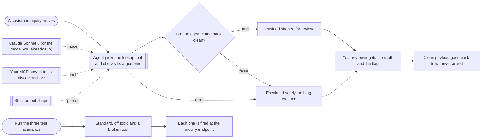

# MCP inquiry agent, read only, with human review

**Category:** AI agents | **Status:** prototype | **AI:** yes | **Nodes:** 13 plus 2 sticky notes

> Prototype: built to a prospect's brief to show the approach; not deployed or run against that prospect's accounts.

An agent answers customer inquiries with tools discovered live from an MCP server, returns a strict JSON draft, and a person approves or escalates it in Slack.

## What it does

A webhook receives an inquiry (id, customer email, text). An AI agent on an Anthropic model gets the MCP server's tools at run time and is told to pick the one that fits, check every required argument against the tool schema before calling it, use read tools only and make at most three calls. A structured output parser forces one shape: summary, retrieved context, draft reply, next action (Approve or Escalate), reason and the tools used. If the agent errors or returns anything else, a fallback node builds the same shape with Escalate and the error as the reason, so the caller always gets a valid payload. Every result is posted to a Slack review channel and returned to the caller. A manual trigger fires three test inquiries at the endpoint: a standard one, an off-topic one and one that should escalate.

## Trigger

- `A customer inquiry arrives`: Webhook, POST /webhook/customer-inquiry
- `Run the three test scenarios`: Manual (test)

## Flow

Rounded boxes are triggers, diamonds are decisions, double boxes are AI steps, dotted lines attach a model, tool or parser to an AI node.

## Key nodes

Webhook, AI Agent, Anthropic Chat Model, MCP Client Tool, Structured Output Parser, Slack

## What to configure

1. Import `workflow.json` (see [How to import](../../README.md#import-a-workflow)).
2. Create these credentials in n8n and select them in the listed nodes:

   - **Anthropic API**: `Claude Sonnet 5 (or the model you already run)`
   - **Header Auth for your MCP server**: `Your MCP server, tools discovered live`
   - **Slack**: `Your reviewer gets the draft and the flag`

3. Replace or fill in these placeholders (some mark an edit spot inside a Code node):

   - `[PLACEHOLDER: one line on the business and what its lookup tools cover]` in `Agent picks the lookup tool and checks its arguments`
   - `[PLACEHOLDER: two lines on tone, e.g. warm, short, no jargon, first name only]` in `Agent picks the lookup tool and checks its arguments`
   - `[YOUR MCP SERVER]` in `Your MCP server, tools discovered live`
   - `N8N_BASE_URL` in `Each one is fired at the inquiry endpoint`

4. Point the MCP Client Tool at your server's SSE endpoint and add its auth header as a credential.

5. Fill the two `[PLACEHOLDER]` lines in the agent's system message (what the business does, and the tone).

## Design notes

- Tools are discovered live from the MCP server, so a new tool on the server needs no workflow change.
- Nothing goes to the customer automatically. The agent drafts, a person decides in Slack.
- Failure is a normal output: the agent's error output and a shape check both lead to an Escalate payload with the same fields, so callers never handle a crash.
- The three test scenarios sit next to the workflow, so every prompt change can be re-tested in one click.

## Limitations

- Read only is enforced by the prompt, not by the server. Connect the agent to an MCP server or token that only exposes read tools.
- The webhook answers after the Slack post, so a slow model keeps the caller waiting.

All 13 nodes

| Node | Type |
|---|---|
| A customer inquiry arrives | `n8n-nodes-base.webhook` v2 |
| Agent picks the lookup tool and checks its arguments | `@n8n/n8n-nodes-langchain.agent` v2 |
| Claude Sonnet 5 (or the model you already run) | `@n8n/n8n-nodes-langchain.lmChatAnthropic` v1.3 |
| Your MCP server, tools discovered live | `@n8n/n8n-nodes-langchain.mcpClientTool` v1 |
| Strict output shape | `@n8n/n8n-nodes-langchain.outputParserStructured` v1.2 |
| Did the agent come back clean? | `n8n-nodes-base.if` v2.2 |
| Escalated safely, nothing crashed | `n8n-nodes-base.set` v3.4 |
| Payload shaped for review | `n8n-nodes-base.set` v3.4 |
| Your reviewer gets the draft and the flag | `n8n-nodes-base.slack` v2.3 |
| Clean payload goes back to whoever asked | `n8n-nodes-base.respondToWebhook` v1.1 |
| Run the three test scenarios | `n8n-nodes-base.manualTrigger` v1 |
| Standard, off topic and a broken tool | `n8n-nodes-base.code` v2 |
| Each one is fired at the inquiry endpoint | `n8n-nodes-base.httpRequest` v4.2 |

