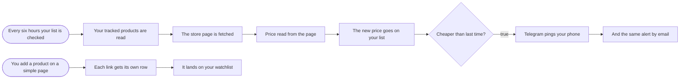

# Price monitoring with Telegram and email alerts

**Category:** E-commerce monitoring | **Status:** prototype | **AI:** no | **Nodes:** 11 plus 2 sticky notes

> Prototype: built to a prospect's brief to show the approach; not deployed or run against that prospect's accounts.

Products added through a form are checked every six hours across stores; a price drop sends a Telegram message and an email.

## What it does

A form takes a product and its store links, one per line, and each link becomes its own row on a Google Sheet watchlist. Every six hours the workflow reads the watchlist and fetches each store page one at a time with a two second gap. A Code node reads the price from the page's schema.org JSON-LD offer, with the `itemprop="price"` and `product:price:amount` meta tags as fallbacks. The new price is written back to the sheet, and when it is lower than the last one, Telegram and Gmail send the old price, the new price, the link and whether it is under your target.

## Trigger

- `Every six hours your list is checked`: Schedule (every 6 hours)
- `You add a product on a simple page`: Form (n8n hosted form, 'Track a product')

## Flow

Rounded boxes are triggers, diamonds are decisions, double boxes are AI steps, dotted lines attach a model, tool or parser to an AI node.

## Key nodes

Schedule, Google Sheets, HTTP Request, Code, IF, Telegram, Gmail, Form

## What to configure

1. Import `workflow.json` (see [How to import](../../README.md#import-a-workflow)).
2. Create these credentials in n8n and select them in the listed nodes:

   - **Gmail OAuth2**: `And the same alert by email`
   - **Google Sheets OAuth2**: `Your tracked products are read`, `The new price goes on your list`, `It lands on your watchlist`
   - **Telegram API**: `Telegram pings your phone`

3. Replace or fill in these placeholders (some mark an edit spot inside a Code node):

   - `[YOUR EMAIL]` in `And the same alert by email`
   - `[YOUR TELEGRAM CHAT ID]` in `Telegram pings your phone`

4. Pick these resources in the node (left empty on purpose):

   - `Your tracked products are read`: documentId, shown as "Price watchlist (pick your sheet)"
   - `Your tracked products are read`: sheetName, shown as "Watchlist"
   - `The new price goes on your list`: documentId, shown as "Price watchlist (pick your sheet)"
   - `The new price goes on your list`: sheetName, shown as "Watchlist"
   - `It lands on your watchlist`: documentId, shown as "Price watchlist (pick your sheet)"
   - `It lands on your watchlist`: sheetName, shown as "Watchlist"

5. In `The new price goes on your list`, map the columns and pick `url` as the column to match on.

## Design notes

- One parser for most stores: the schema.org offer block that shops publish for search engines, plus two meta tag fallbacks.
- Polite fetching: one request at a time, two seconds apart, with a browser user agent.
- An alert needs a real drop against the last stored price, and it says whether the target was reached.

## Limitations

- Stores that render the price with JavaScript return no price. The row is marked unreadable and needs a store-specific rule.
- Prices written with a thousands separator and a decimal comma (1.299,00) do not parse; JSON-LD prices normally use a plain decimal point.

All 11 nodes

| Node | Type |
|---|---|
| Every six hours your list is checked | `n8n-nodes-base.scheduleTrigger` v1.2 |
| Your tracked products are read | `n8n-nodes-base.googleSheets` v4.5 |
| The store page is fetched | `n8n-nodes-base.httpRequest` v4.2 |
| Price read from the page | `n8n-nodes-base.code` v2 |
| The new price goes on your list | `n8n-nodes-base.googleSheets` v4.5 |
| Cheaper than last time? | `n8n-nodes-base.if` v2.2 |
| Telegram pings your phone | `n8n-nodes-base.telegram` v1.2 |
| And the same alert by email | `n8n-nodes-base.gmail` v2.1 |
| You add a product on a simple page | `n8n-nodes-base.formTrigger` v2.4 |
| Each link gets its own row | `n8n-nodes-base.code` v2 |
| It lands on your watchlist | `n8n-nodes-base.googleSheets` v4.5 |

