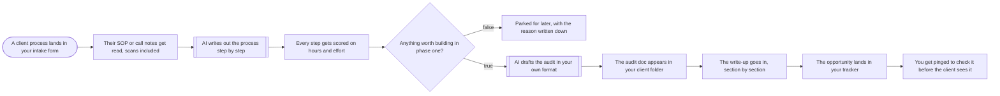

# Process audit to automation plan

**Category:** Consulting ops | **Status:** prototype | **AI:** yes | **Nodes:** 11 plus 2 sticky notes

> Prototype: built to a prospect's brief to show the approach; not deployed or run against that prospect's accounts.

An intake form with an SOP or call notes becomes a scored step list, an audit document with hours and value saved, a tracker row and a review ping.

## What it does

An n8n form takes one client process: company, process name, owner, frequency, tools, what goes wrong today, and the SOP or call notes as a file. The PDF text is extracted and OpenAI returns the process as strict JSON, step by step: owner, runs per month, minutes per run, kind (manual, rule based, judgement), whether it can be automated, how, and a confidence. A Code node does the money: hours per month, the share that can be automated, value at your hourly rate, build cost by effort, payback in months, and a phase one flag for steps that save at least four hours a month, pay back within three months and have a confidence of 0.6 or more. If nothing qualifies, the scored process is parked in a sheet. Otherwise a second OpenAI call drafts the audit in fixed sections using only those numbers, the text goes into a new Google Doc, the opportunity goes into a tracker sheet, and Slack asks you to review it before the client sees it.

## Trigger

- `A client process lands in your intake form`: Form (n8n hosted form, 'Process audit intake')

## Flow

Rounded boxes are triggers, diamonds are decisions, double boxes are AI steps, dotted lines attach a model, tool or parser to an AI node.

## Key nodes

Form, Extract from File, OpenAI, Code, IF, Google Docs, Google Sheets, Slack

## What to configure

1. Import `workflow.json` (see [How to import](../../README.md#import-a-workflow)).
2. Create these credentials in n8n and select them in the listed nodes:

   - **Google Docs OAuth2**: `The audit doc appears in your client folder`, `The write-up goes in, section by section`
   - **Google Sheets OAuth2**: `Parked for later, with the reason written down`, `The opportunity lands in your tracker`
   - **OpenAI API**: `AI writes out the process step by step`, `AI drafts the audit in your own format`
   - **Slack**: `You get pinged to check it before the client sees it`

3. Replace or fill in these placeholders (some mark an edit spot inside a Code node):

   - `[PLACEHOLDER]` in `Every step gets scored on hours and effort`, `AI drafts the audit in your own format`

4. Pick these resources in the node (left empty on purpose):

   - `Parked for later, with the reason written down`: documentId
   - `Parked for later, with the reason written down`: sheetName
   - `The audit doc appears in your client folder`: folderId
   - `The opportunity lands in your tracker`: documentId
   - `The opportunity lands in your tracker`: sheetName
   - `You get pinged to check it before the client sees it`: channelId

5. Set `RATE` and `BUILD_DAY` in `Every step gets scored on hours and effort` to your numbers.

## Design notes

- The model extracts and drafts; the arithmetic (hours, value, payback, phase one) is plain code with your rates as constants, so the numbers are reproducible.
- Steps with low confidence are carried into the audit as open questions instead of being dropped.
- A person reviews every audit before the client sees it.

## Limitations

- Only PDFs are read. The form also accepts .docx and images, which need a conversion or OCR step.
- The effort table (half a day to two days per step) is a rough default.

All 11 nodes

| Node | Type |
|---|---|
| A client process lands in your intake form | `n8n-nodes-base.formTrigger` v2.4 |
| Their SOP or call notes get read, scans included | `n8n-nodes-base.extractFromFile` v1 |
| AI writes out the process step by step | `@n8n/n8n-nodes-langchain.openAi` v1.8 |
| Every step gets scored on hours and effort | `n8n-nodes-base.code` v2 |
| Anything worth building in phase one? | `n8n-nodes-base.if` v2.2 |
| Parked for later, with the reason written down | `n8n-nodes-base.googleSheets` v4.5 |
| AI drafts the audit in your own format | `@n8n/n8n-nodes-langchain.openAi` v1.8 |
| The audit doc appears in your client folder | `n8n-nodes-base.googleDocs` v2 |
| The write-up goes in, section by section | `n8n-nodes-base.googleDocs` v2 |
| The opportunity lands in your tracker | `n8n-nodes-base.googleSheets` v4.5 |
| You get pinged to check it before the client sees it | `n8n-nodes-base.slack` v2.3 |

