# Shorts approval and publish (template)

**Category:** Content ops | **Status:** production pattern | **AI:** yes | **Nodes:** 33 plus 2 sticky notes

> Production pattern: a template from my agency's client delivery work; per-client copies are made from it.

A client approves, regenerates or skips AI-cut Shorts from a magic link or a free-text email reply. Approved clips get a title, captions and a YouTube upload.

## What it does

The second half of a client Shorts pipeline. The review email from the long-form to Shorts template has Approve, Regenerate and Skip buttons per clip, and each button is a magic link to this workflow's webhook. A client can also just reply in plain words ("approve 1 and 3, skip the rest"): a Gmail trigger reads the reply, an AI agent on Gemini turns it into one decision per clip, and a sheet lookup adds the Klap folder id. Both paths merge into one Switch:

- **approve**: export the clip from Klap and poll until it is ready, generate a title, description and three hashtags with Gemini, burn in captions with the VEED subtitles model on fal.ai, upload to YouTube and log the upload.
- **regenerate**: look up the source video in the tracking sheet, submit a new Klap task, poll, log the new clips and send a fresh review email with new magic links.
- **skip**: log the decision.

## Trigger

- `Webhook: client-slug-shorts-approve`: Webhook, GET /webhook/client-slug-shorts-approve
- `Gmail: Client Reply (label:client:client-slug)`: Gmail (polls every minute, query: label:client:client-slug to:shorts@example.com (subject:Re OR subject:re))

## Flow

```mermaid
flowchart LR
  n1(["Webhook: client-slug-shorts-approve"])
  n2["Decision from Magic Link"]
  n3(["Gmail: Client Reply (label:client:client-slug)"])
  n4[["Agent: Evaluate Client Reply"]]
  n5[["Gemini Chat Model (for Agent)"]]
  n6["Parse Agent Decisions"]
  n7["Merge Decisions"]
  n8{"Switch on action"}
  n9["Klap: Export Clip"]
  n10["Wait 30s (export)"]
  n11["Klap: Export Status"]
  n12{"IF: Export Ready?"}
  n13["Gemini: Generate Title + Desc + 3 Hashtags"]
  n14["Prepare YouTube Upload Payload"]
  n15["YouTube: Upload as Short (CLIENT)"]
  n16["Log Skip → Sheet (YCAT)"]
  n17["Respond to Webhook"]
  n18["Prepare Regen Submit"]
  n19["Klap: Resubmit Task (regen)"]
  n20["Wait 1 min (regen)"]
  n21["Klap: Get Status (regen)"]
  n22{"IF: Regen Status Ready?"}
  n23["Klap: Get Shorts (regen)"]
  n24["Log Regen Shorts → Sheet"]
  n25["Aggregate Regen Clips"]
  n26["Render Regen Clip HTML"]
  n27["Gmail: Send Re-Review"]
  n28["Log Approve → Sheet"]
  n29["Sheet: Lookup folder_id by clip_id"]
  n30["Enrich Decision with folder_id"]
  n31["VEED: Add Subtitles"]
  n32["Download Captioned Video"]
  n33["Sheet: Lookup URL by folder_id"]
  n1 --> n2
  n2 --> n17
  n2 --> n7
  n3 --> n4
  n5 -.->|model| n4
  n4 --> n6
  n6 --> n29
  n7 --> n8
  n8 -->|approve| n9
  n8 -->|regenerate| n33
  n8 -->|skip| n16
  n9 --> n10
  n10 --> n11
  n11 --> n12
  n12 -->|true| n13
  n12 -->|false| n10
  n13 --> n14
  n14 --> n31
  n15 --> n28
  n18 --> n19
  n19 --> n20
  n20 --> n21
  n21 --> n22
  n22 -->|true| n23
  n22 -->|false| n20
  n23 --> n24
  n24 --> n25
  n25 --> n26
  n26 --> n27
  n29 --> n30
  n30 --> n7
  n31 --> n32
  n32 --> n15
  n33 --> n18
```

Rounded boxes are triggers, diamonds are decisions, double boxes are AI steps, dotted lines attach a model, tool or parser to an AI node.

## Key nodes

Webhook, Gmail Trigger, AI Agent (Gemini), Switch, Klap API, fal.ai VEED subtitles, YouTube

## What to configure

1. Import `workflow.json` (see [How to import](../../README.md#import-a-workflow)).
2. Create these credentials in n8n and select them in the listed nodes:

   - **Gmail OAuth2**: `Gmail: Client Reply (label:client:client-slug)`, `Gmail: Send Re-Review`
   - **Google Gemini (PaLM) API**: `Gemini Chat Model (for Agent)`
   - **Google Sheets OAuth2**: `Log Skip → Sheet (YCAT)`, `Log Regen Shorts → Sheet`, `Log Approve → Sheet`, `Sheet: Lookup folder_id by clip_id`, `Sheet: Lookup URL by folder_id`
   - **Header Auth for api.klap.app**: `Klap: Export Clip`, `Klap: Export Status`, `Klap: Resubmit Task (regen)`, `Klap: Get Status (regen)`, `Klap: Get Shorts (regen)`
   - **Header Auth for fal.run**: `VEED: Add Subtitles`
   - **Header Auth for generativelanguage.googleapis.com**: `Gemini: Generate Title + Desc + 3 Hashtags`
   - **YouTube OAuth2**: `YouTube: Upload as Short (CLIENT)`

3. Replace or fill in these placeholders (some mark an edit spot inside a Code node):

   - `client-slug` in `Webhook: client-slug-shorts-approve`, `Gmail: Client Reply (label:client:client-slug)`, `Prepare YouTube Upload Payload`, `Render Regen Clip HTML`, `Gmail: Send Re-Review`, `Log Approve → Sheet`
   - `N8N_BASE_URL` in `Render Regen Clip HTML`
   - `REPLACE_WITH_CLIENT_EMAIL` in `Gmail: Send Re-Review`
   - `YOUR_SHEET_ID` in `Log Skip → Sheet (YCAT)`, `Log Regen Shorts → Sheet`, `Log Approve → Sheet`, `Sheet: Lookup folder_id by clip_id`, `Sheet: Lookup URL by folder_id`

4. Replace the token `client-slug` everywhere (webhook path, Gmail label filter, email subjects) with your client's slug, as the header sticky note describes.

5. Set the tracking sheet columns: timestamp, source_type, youtube_url, video_title, from_address, raw_email_excerpt, klap_task_id, klap_folder_id, status. The long-form to Shorts template writes to the same sheet.

6. Uploads are forced to private in `Prepare YouTube Upload Payload` (`privacy: 'private'`). Change it when the copy goes live.

## Design notes

- Two ways to decide, one decision shape. The magic link and the email reply both end as `{clip_id, folder_id, action, publish_when}` before the Switch, so the publish logic exists once.
- The webhook answers the client at once (Respond to Webhook runs before the slow Klap and upload work). The workflow has a 30 minute execution timeout for the polling loops.
- Polling loops (Wait, status call, IF back to Wait) for the Klap export and the regeneration task, instead of one long fixed sleep.
- Gemini is called with a JSON schema (`responseJsonSchema`), so the title and hashtags are parsed, not scraped out of prose. The reply agent defaults to skip when a reply is unclear.

## Limitations

- The polling loops have no retry cap. A Klap task that never reaches ready keeps looping until the execution timeout.
- The magic links carry clip id, folder id and action in the query string with no signature. Anyone with the link can approve, which is acceptable for a private review email but not for a public page.
- `regenerate_focus` from the reply agent is only stored for reference; Klap's submit endpoint has no field for it (noted in a sticky).
- One client per copy: the template is copied and its tokens and credentials replaced per client.

All 33 nodes

| Node | Type |
|---|---|
| Webhook: client-slug-shorts-approve | `n8n-nodes-base.webhook` v2 |
| Decision from Magic Link | `n8n-nodes-base.set` v3.4 |
| Gmail: Client Reply (label:client:client-slug) | `n8n-nodes-base.gmailTrigger` v1.2 |
| Agent: Evaluate Client Reply | `@n8n/n8n-nodes-langchain.agent` v1.7 |
| Gemini Chat Model (for Agent) | `@n8n/n8n-nodes-langchain.lmChatGoogleGemini` v1 |
| Parse Agent Decisions | `n8n-nodes-base.code` v2 |
| Merge Decisions | `n8n-nodes-base.merge` v3 |
| Switch on action | `n8n-nodes-base.switch` v3.2 |
| Klap: Export Clip | `n8n-nodes-base.httpRequest` v4.2 |
| Wait 30s (export) | `n8n-nodes-base.wait` v1.1 |
| Klap: Export Status | `n8n-nodes-base.httpRequest` v4.2 |
| IF: Export Ready? | `n8n-nodes-base.if` v2.2 |
| Gemini: Generate Title + Desc + 3 Hashtags | `n8n-nodes-base.httpRequest` v4.2 |
| Prepare YouTube Upload Payload | `n8n-nodes-base.code` v2 |
| YouTube: Upload as Short (CLIENT) | `n8n-nodes-base.youTube` v1 |
| Log Skip → Sheet (YCAT) | `n8n-nodes-base.googleSheets` v4.5 |
| Respond to Webhook | `n8n-nodes-base.respondToWebhook` v1.1 |
| Prepare Regen Submit | `n8n-nodes-base.code` v2 |
| Klap: Resubmit Task (regen) | `n8n-nodes-base.httpRequest` v4.2 |
| Wait 1 min (regen) | `n8n-nodes-base.wait` v1.1 |
| Klap: Get Status (regen) | `n8n-nodes-base.httpRequest` v4.2 |
| IF: Regen Status Ready? | `n8n-nodes-base.if` v2.2 |
| Klap: Get Shorts (regen) | `n8n-nodes-base.httpRequest` v4.2 |
| Log Regen Shorts → Sheet | `n8n-nodes-base.googleSheets` v4.5 |
| Aggregate Regen Clips | `n8n-nodes-base.aggregate` v1 |
| Render Regen Clip HTML | `n8n-nodes-base.code` v2 |
| Gmail: Send Re-Review | `n8n-nodes-base.gmail` v2.1 |
| Log Approve → Sheet | `n8n-nodes-base.googleSheets` v4.5 |
| Sheet: Lookup folder_id by clip_id | `n8n-nodes-base.googleSheets` v4.5 |
| Enrich Decision with folder_id | `n8n-nodes-base.code` v2 |
| VEED: Add Subtitles | `n8n-nodes-base.httpRequest` v4.2 |
| Download Captioned Video | `n8n-nodes-base.httpRequest` v4.2 |
| Sheet: Lookup URL by folder_id | `n8n-nodes-base.googleSheets` v4.5 |

