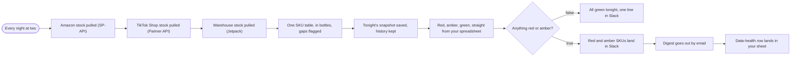

# Daily stock sync with red, amber, green alerts

**Category:** E-commerce ops | **Status:** prototype | **AI:** no | **Nodes:** 12 plus 2 sticky notes

> Prototype: built to a prospect's brief to show the approach; not deployed or run against that prospect's accounts.

Nightly pull of Amazon, TikTok Shop and warehouse stock into one SKU table in Postgres, with red, amber or green status per SKU and data-health flags.

## What it does

At 02:00 the workflow pulls inventory from the Amazon Selling Partner API, the TikTok Shop Partner API and the Jetpack warehouse API. A Code node maps every marketplace SKU through a SKU map to one internal SKU, converts packs to bottles, and flags unmapped SKUs, missing lead times and missing delivery dates. Each row is inserted into a Postgres snapshot table (insert only, one row per date, SKU and source). A second Code node applies the rules from the existing stock spreadsheet: days of cover against lead time plus safety days gives red, amber or green, and a SKU without a sales rate stays grey, never green. Red and amber SKUs go to Slack and an email digest, followed by a data-health row in a Google Sheet. An all-green night posts one line to Slack.

## Trigger

- `Every night at two`: Schedule (every day at 02:00)

## Flow

Rounded boxes are triggers, diamonds are decisions, double boxes are AI steps, dotted lines attach a model, tool or parser to an AI node.

## Key nodes

Schedule, HTTP Request (Amazon SP-API, TikTok Shop, Jetpack), Code, Postgres, Slack, Gmail, Google Sheets

## What to configure

1. Import `workflow.json` (see [How to import](../../README.md#import-a-workflow)).
2. Create these credentials in n8n and select them in the listed nodes:

   - **Gmail OAuth2**: `Digest goes out by email`
   - **Google Sheets OAuth2**: `Data-health row lands in your sheet`
   - **Postgres**: `Tonight's snapshot saved, history kept`
   - **Slack**: `All green tonight, one line in Slack`, `Red and amber SKUs land in Slack`

3. Replace or fill in these placeholders (some mark an edit spot inside a Code node):

   - `[ACCESS TOKEN]` in `TikTok Shop stock pulled (Partner API)`
   - `[APP KEY]` in `TikTok Shop stock pulled (Partner API)`
   - `[DAILY SALES RATE]` in `Red, amber, green, straight from your spreadsheet`
   - `[JETPACK API BASE]` in `Warehouse stock pulled (Jetpack)`
   - `[JETPACK API KEY]` in `Warehouse stock pulled (Jetpack)`
   - `[LWA ACCESS TOKEN]` in `Amazon stock pulled (SP-API)`
   - `[RULES]` in `Red, amber, green, straight from your spreadsheet`
   - `[SHOP CIPHER]` in `TikTok Shop stock pulled (Partner API)`
   - `[SIGN]` in `TikTok Shop stock pulled (Partner API)`
   - `[SKU MAP]` in `One SKU table, in bottles, gaps flagged`

4. Pick these resources in the node (left empty on purpose):

   - `Data-health row lands in your sheet`: documentId, shown as "Data health (pick your sheet)"
   - `Data-health row lands in your sheet`: sheetName, shown as "Nightly"

5. Create the `inventory_snapshots` table with a unique key on `(snapshot_date, sku, source)`; the insert relies on it (`ON CONFLICT DO NOTHING`).

6. Fill `SKU_MAP` in `One SKU table, in bottles, gaps flagged` (marketplace code, internal SKU, bottles per unit, lead time).

## Design notes

- All maths in one unit (bottles), converted at the edge through the SKU map, so packs and single units never get mixed.
- Unknown data is grey, never green, and a trust value is shown next to every status.
- History is insert only, so a rerun on the same night cannot overwrite a snapshot.
- Thresholds (safety days, demand change) are constants at the top of the rules node, ready to move into an admin table.

## Limitations

- The sales rate map is empty as built (phase two in the brief), so every SKU is grey and the red and amber branch does not fire yet.
- The data-health row is only written on nights with red or amber SKUs; the all-green branch ends at Slack.
- The Amazon and TikTok calls take a pasted access token and signature. Production needs the LWA token refresh and TikTok request signing as their own steps.

All 12 nodes

| Node | Type |
|---|---|
| Every night at two | `n8n-nodes-base.scheduleTrigger` v1.2 |
| Amazon stock pulled (SP-API) | `n8n-nodes-base.httpRequest` v4.2 |
| TikTok Shop stock pulled (Partner API) | `n8n-nodes-base.httpRequest` v4.2 |
| Warehouse stock pulled (Jetpack) | `n8n-nodes-base.httpRequest` v4.2 |
| One SKU table, in bottles, gaps flagged | `n8n-nodes-base.code` v2 |
| Tonight's snapshot saved, history kept | `n8n-nodes-base.postgres` v2.5 |
| Red, amber, green, straight from your spreadsheet | `n8n-nodes-base.code` v2 |
| Anything red or amber? | `n8n-nodes-base.if` v2.2 |
| All green tonight, one line in Slack | `n8n-nodes-base.slack` v2.3 |
| Red and amber SKUs land in Slack | `n8n-nodes-base.slack` v2.3 |
| Digest goes out by email | `n8n-nodes-base.gmail` v2.1 |
| Data-health row lands in your sheet | `n8n-nodes-base.googleSheets` v4.5 |

