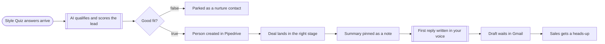

# Style quiz lead to Pipedrive deal

**Category:** CRM and lead routing | **Status:** prototype | **AI:** yes | **Nodes:** 10 plus 2 sticky notes

> Prototype: built to a prospect's brief to show the approach; not deployed or run against that prospect's accounts.

Quiz answers are scored by OpenAI; good fits become a Pipedrive person, deal and note plus a drafted first reply in Gmail, the rest are kept as nurture contacts.

## What it does

An n8n form stands in for the website quiz (style, rooms, budget band, start date, notes). OpenAI qualifies the lead into fixed fields: style, budget band, urgency, a 0 to 100 fit score, a two sentence summary and an opening line for the reply. A score of 60 or more creates a Pipedrive person, a deal and a note with the score and summary. A second OpenAI call then drafts a first reply in the studio's voice, saved as a Gmail draft for sales to check and send, and sales gets a heads-up email. Lower scores are saved as a Pipedrive person for nurture, without a deal.

## Trigger

- `Style Quiz answers arrive`: Form (n8n hosted form, 'Style Quiz')

## Flow

Rounded boxes are triggers, diamonds are decisions, double boxes are AI steps, dotted lines attach a model, tool or parser to an AI node.

## Key nodes

Form, OpenAI, IF, Pipedrive, Gmail

## What to configure

1. Import `workflow.json` (see [How to import](../../README.md#import-a-workflow)).
2. Create these credentials in n8n and select them in the listed nodes:

   - **Gmail OAuth2**: `Draft waits in Gmail`, `Sales gets a heads-up`
   - **OpenAI API**: `AI qualifies and scores the lead`, `First reply written in your voice`
   - **Pipedrive API**: `Parked as a nurture contact`, `Person created in Pipedrive`, `Deal lands in the right stage`, `Summary pinned as a note`

3. Replace or fill in these placeholders (some mark an edit spot inside a Code node):

   - `[EXAMPLE 1]` in `First reply written in your voice`
   - `[EXAMPLE 2]` in `First reply written in your voice`

4. Replace the form trigger with your quiz's webhook, and paste real past first replies into the drafting prompt.

5. Set the pipeline stage in `Deal lands in the right stage`; without it Pipedrive uses the default stage.

## Design notes

- Scoring returns a fixed schema, so routing is a plain IF on a number.
- The first reply is a draft and never sent automatically.
- The scoring rule is written in the prompt in plain words (budget above 50k and ready within a quarter scores high), so a non-developer can change it.

## Limitations

- The person is created without searching first, so a returning lead becomes a second Pipedrive person. The node note says matched by email; the node itself does not search.

All 10 nodes

| Node | Type |
|---|---|
| Style Quiz answers arrive | `n8n-nodes-base.formTrigger` v2.4 |
| AI qualifies and scores the lead | `@n8n/n8n-nodes-langchain.openAi` v1.8 |
| Good fit? | `n8n-nodes-base.if` v2.2 |
| Parked as a nurture contact | `n8n-nodes-base.pipedrive` v1 |
| Person created in Pipedrive | `n8n-nodes-base.pipedrive` v1 |
| Deal lands in the right stage | `n8n-nodes-base.pipedrive` v1 |
| Summary pinned as a note | `n8n-nodes-base.pipedrive` v1 |
| First reply written in your voice | `@n8n/n8n-nodes-langchain.openAi` v1.8 |
| Draft waits in Gmail | `n8n-nodes-base.gmail` v2.1 |
| Sales gets a heads-up | `n8n-nodes-base.gmail` v2.1 |

