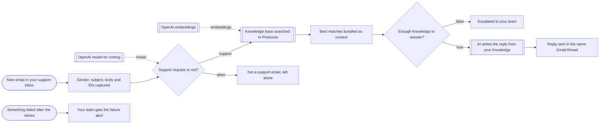

# AI support replies from a knowledge base

**Category:** Customer support | **Status:** prototype | **AI:** yes | **Nodes:** 14 plus 2 sticky notes

> Prototype: built to a prospect's brief to show the approach; not deployed or run against that prospect's accounts.

Support emails are answered from a Pinecone knowledge base in the same Gmail thread, or handed to a person when the knowledge base has no solid match.

## What it does

A Gmail trigger reads new unread mail. A text classifier on gpt-4.1-mini sorts it into support or other; everything else stays untouched in the inbox. For support mail the subject and body are searched in Pinecone, and a Code node keeps only matches above a similarity threshold and joins them into one context block. With at least one good match, OpenAI writes a short reply that may only use facts from those excerpts, and the reply goes out in the same Gmail thread. With no good match, the email goes to a person together with the best score. An Error Trigger branch emails the team when any step fails after its retries.

## Trigger

- `New email in your support inbox`: Gmail (polls every minute)
- `Something failed after the retries`: Error trigger

## Flow

Rounded boxes are triggers, diamonds are decisions, double boxes are AI steps, dotted lines attach a model, tool or parser to an AI node.

## Key nodes

Gmail Trigger, Text Classifier, Pinecone Vector Store, OpenAI, Gmail, Error Trigger

## What to configure

1. Import `workflow.json` (see [How to import](../../README.md#import-a-workflow)).
2. Create these credentials in n8n and select them in the listed nodes:

   - **Gmail OAuth2**: `New email in your support inbox`, `Escalated to your team`, `Reply sent in the same Gmail thread`, `Your team gets the failure alert`
   - **OpenAI API**: `OpenAI model for sorting`, `OpenAI embeddings`, `AI writes the reply from your knowledge`
   - **Pinecone API**: `Knowledge base searched in Pinecone`

3. Replace or fill in these placeholders (some mark an edit spot inside a Code node):

   - `[AGENCY NAME]` in `AI writes the reply from your knowledge`
   - `[SIGN-OFF]` in `AI writes the reply from your knowledge`
   - `[SUPPORT LEAD EMAIL]` in `Escalated to your team`, `Your team gets the failure alert`
   - `[YOUR-INDEX]` in `Knowledge base searched in Pinecone`
   - `[YOUR-NAMESPACE]` in `Knowledge base searched in Pinecone`

4. Load your documents into the Pinecone index with `text-embedding-3-small`, the same model the search node uses.

5. Tune `THRESHOLD` (0.75) in `Best matches bundled as context` on a sample of real emails.

6. In the workflow settings, select this workflow as its own error workflow, otherwise the Error Trigger branch never runs.

## Design notes

- Classify first, so newsletters and auto-replies never reach the model that writes replies.
- A hard similarity threshold in code decides between answering and escalating. The writing model never sees weak matches.
- The reply prompt forbids invented prices, dates, links or promises, and tells the model to hand the rest to a person when the excerpts only answer part of the question.
- Retries with backoff on every external call, plus an Error Trigger alert, so a failed reply is visible instead of silent.

## Limitations

- Only reads the knowledge base. Loading and updating the Pinecone index is a separate job.
- Replies go out without review once the threshold is met. Start with a higher threshold, or swap the reply node for a draft.

All 14 nodes

| Node | Type |
|---|---|
| New email in your support inbox | `n8n-nodes-base.gmailTrigger` v1.2 |
| Sender, subject, body and IDs captured | `n8n-nodes-base.set` v3.4 |
| Support request or not? | `@n8n/n8n-nodes-langchain.textClassifier` v1 |
| OpenAI model for sorting | `@n8n/n8n-nodes-langchain.lmChatOpenAi` v1 |
| Knowledge base searched in Pinecone | `@n8n/n8n-nodes-langchain.vectorStorePinecone` v1 |
| OpenAI embeddings | `@n8n/n8n-nodes-langchain.embeddingsOpenAi` v1 |
| Best matches bundled as context | `n8n-nodes-base.code` v2 |
| Enough knowledge to answer? | `n8n-nodes-base.if` v2.2 |
| Escalated to your team | `n8n-nodes-base.gmail` v2.1 |
| AI writes the reply from your knowledge | `@n8n/n8n-nodes-langchain.openAi` v1.8 |
| Reply sent in the same Gmail thread | `n8n-nodes-base.gmail` v2.1 |
| Not a support email, left alone | `n8n-nodes-base.noOp` v1 |
| Something failed after the retries | `n8n-nodes-base.errorTrigger` v1 |
| Your team gets the failure alert | `n8n-nodes-base.gmail` v2.1 |

