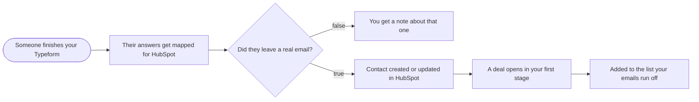

# Typeform leads into HubSpot and email segments

**Category:** CRM and lead routing | **Status:** prototype | **AI:** no | **Nodes:** 7 plus 2 sticky notes

> Prototype: built to a prospect's brief to show the approach; not deployed or run against that prospect's accounts.

Typeform answers are mapped in code, upserted as HubSpot contacts on email, opened as a deal and added to the list that starts the matching email segment.

## What it does

The Typeform trigger fires on every submission. A Code node maps question titles to HubSpot fields (several common spellings per field) and picks the email segment list from the answer to the segment question, with a default list. Submissions without a usable email are emailed to you with everything they answered, so no lead disappears. Valid ones are upserted as HubSpot contacts on email with lifecycle stage lead, a deal opens and is associated with the contact, and the contact is added to the segment list through the HubSpot lists API, which is what starts the emails.

## Trigger

- `Someone finishes your Typeform`: Typeform

## Flow

Rounded boxes are triggers, diamonds are decisions, double boxes are AI steps, dotted lines attach a model, tool or parser to an AI node.

## Key nodes

Typeform Trigger, Code, IF, HubSpot, HTTP Request (HubSpot lists API), Gmail

## What to configure

1. Import `workflow.json` (see [How to import](../../README.md#import-a-workflow)).
2. Create these credentials in n8n and select them in the listed nodes:

   - **Gmail OAuth2**: `You get a note about that one`
   - **HubSpot App Token**: `Contact created or updated in HubSpot`, `A deal opens in your first stage`, `Added to the list your emails run off`
   - **Typeform API**: `Someone finishes your Typeform`

3. Replace or fill in these placeholders (some mark an edit spot inside a Code node):

   - `[ANSWER OPTION A]` in `Their answers get mapped for HubSpot`
   - `[ANSWER OPTION B]` in `Their answers get mapped for HubSpot`
   - `[ANSWER OPTION C]` in `Their answers get mapped for HubSpot`
   - `[HUBSPOT LIST ID A]` in `Their answers get mapped for HubSpot`
   - `[HUBSPOT LIST ID B]` in `Their answers get mapped for HubSpot`
   - `[HUBSPOT LIST ID C]` in `Their answers get mapped for HubSpot`
   - `[HUBSPOT LIST ID DEFAULT]` in `Their answers get mapped for HubSpot`
   - `[YOUR EMAIL]` in `You get a note about that one`
   - `[YOUR SEGMENT QUESTION TITLE]` in `Their answers get mapped for HubSpot`
   - `[YOUR TYPEFORM FORM ID]` in `Someone finishes your Typeform`

4. Set your pipeline stage in `A deal opens in your first stage` (it uses HubSpot's default `appointmentscheduled`).

## Design notes

- All field mapping lives in one Code node with a segment table at the top, so a renamed Typeform question is a one line change.
- Contacts are upserted on email, so repeat submissions update the same contact.
- Bad submissions are not dropped: they are emailed with the raw answers.

## Limitations

- The email check is a simple contains `@` and `.` test.

All 7 nodes

| Node | Type |
|---|---|
| Someone finishes your Typeform | `n8n-nodes-base.typeformTrigger` v1 |
| Their answers get mapped for HubSpot | `n8n-nodes-base.code` v2 |
| Did they leave a real email? | `n8n-nodes-base.if` v2.2 |
| You get a note about that one | `n8n-nodes-base.gmail` v2.1 |
| Contact created or updated in HubSpot | `n8n-nodes-base.hubspot` v2.1 |
| A deal opens in your first stage | `n8n-nodes-base.hubspot` v2.1 |
| Added to the list your emails run off | `n8n-nodes-base.httpRequest` v4.2 |

