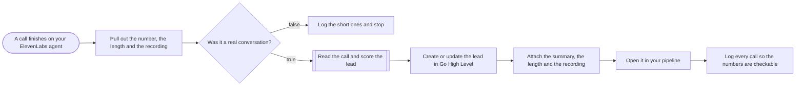

# Voice agent calls into GoHighLevel with summary and recording

**Category:** Voice AI ops | **Status:** prototype | **AI:** yes | **Nodes:** 9 plus 2 sticky notes

> Prototype: built to a prospect's brief to show the approach; not deployed or run against that prospect's accounts.

ElevenLabs agent calls that were real conversations are scored by OpenAI and land in GoHighLevel as a contact, a note with summary, length and recording, and an opportunity.

## What it does

The ElevenLabs post-call webhook arrives (the calls run through Telnyx). A Set node pulls out the conversation id, phone, direction, duration, the transcript as text and the recording link. A call counts as a conversation when it lasted at least 40 seconds and the caller said something; everything else is logged to a Not a lead tab with the reason. For real calls OpenAI reads the transcript for a real estate investment firm and returns a summary, property, motivation, timeline, price expectation and a qualified flag with a reason. The contact is upserted in GoHighLevel on the phone number with tags and custom fields, a note gets the summary, length, recording and call id, an opportunity opens in the qualified or needs-review stage, and the call is logged.

## Trigger

- `A call finishes on your ElevenLabs agent`: Webhook, POST /webhook/elevenlabs-call-ended

## Flow

Rounded boxes are triggers, diamonds are decisions, double boxes are AI steps, dotted lines attach a model, tool or parser to an AI node.

## Key nodes

Webhook, Set, IF, OpenAI, HTTP Request (GoHighLevel), Google Sheets

## What to configure

1. Import `workflow.json` (see [How to import](../../README.md#import-a-workflow)).
2. Create these credentials in n8n and select them in the listed nodes:

   - **Google Sheets OAuth2**: `Log the short ones and stop`, `Log every call so the numbers are checkable`
   - **OpenAI API**: `Read the call and score the lead`

3. Replace or fill in these placeholders (some mark an edit spot inside a Code node):

   - `[NEEDS REVIEW STAGE ID]` in `Open it in your pipeline`
   - `[QUALIFIED STAGE ID]` in `Open it in your pipeline`
   - `[YOUR GHL LOCATION ID]` in `Create or update the lead in Go High Level`, `Open it in your pipeline`
   - `[YOUR GHL PRIVATE INTEGRATION TOKEN]` in `Create or update the lead in Go High Level`, `Attach the summary, the length and the recording`, `Open it in your pipeline`
   - `[YOUR GHL USER ID]` in `Attach the summary, the length and the recording`
   - `[YOUR PIPELINE ID]` in `Open it in your pipeline`

4. Pick these resources in the node (left empty on purpose):

   - `Log the short ones and stop`: documentId, shown as "Call log (pick your sheet)"
   - `Log the short ones and stop`: sheetName, shown as "Not a lead"
   - `Log every call so the numbers are checkable`: documentId, shown as "Call log (pick your sheet)"
   - `Log every call so the numbers are checkable`: sheetName, shown as "Calls"

5. Create the GoHighLevel custom fields the payload uses: call_id, call_duration_secs, call_recording, seller_timeline.

## Design notes

- A call is judged on duration and on whether the other side spoke, so a long voicemail or silence does not become a lead.
- Contacts are upserted on the phone number, so a retried webhook does not create a second lead.
- The model fills fixed fields and must leave a field empty rather than invent it.
- Every call, lead or not, is logged, so call and lead counts can be checked.

## Limitations

- The recording link points at the ElevenLabs API audio endpoint, which needs an API key to play. Store a public or signed URL if the team should click it.
- The GoHighLevel token is a header placeholder. A Header Auth credential is the better home.

All 9 nodes

| Node | Type |
|---|---|
| A call finishes on your ElevenLabs agent | `n8n-nodes-base.webhook` v2 |
| Pull out the number, the length and the recording | `n8n-nodes-base.set` v3.4 |
| Was it a real conversation? | `n8n-nodes-base.if` v2.2 |
| Log the short ones and stop | `n8n-nodes-base.googleSheets` v4.5 |
| Read the call and score the lead | `@n8n/n8n-nodes-langchain.openAi` v1.8 |
| Create or update the lead in Go High Level | `n8n-nodes-base.httpRequest` v4.2 |
| Attach the summary, the length and the recording | `n8n-nodes-base.httpRequest` v4.2 |
| Open it in your pipeline | `n8n-nodes-base.httpRequest` v4.2 |
| Log every call so the numbers are checkable | `n8n-nodes-base.googleSheets` v4.5 |

