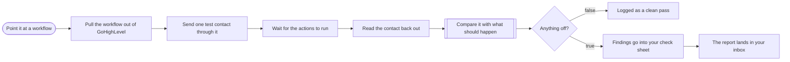

# Workflow health check for GoHighLevel

**Category:** QA and monitoring | **Status:** prototype | **AI:** yes | **Nodes:** 10 plus 2 sticky notes

> Prototype: built to a prospect's brief to show the approach; not deployed or run against that prospect's accounts.

Point a form at a GoHighLevel workflow: a tagged test contact is pushed through, read back after two minutes, and OpenAI compares the result with what should have happened.

## What it does

A form takes the workflow name, the platform, what should happen and a test email. The workflow pulls the location's workflows from the GoHighLevel API, upserts one test contact tagged `healthcheck`, waits two minutes for the automations to run, and reads the contact back. OpenAI compares the expected behaviour with the workflow configuration and the contact's state and returns JSON: passed, broken step, likely cause, fix and confidence. Passes are logged to a sheet; failures are logged as findings and emailed.

## Trigger

- `Point it at a workflow`: Form (n8n hosted form, 'Workflow health check')

## Flow

Rounded boxes are triggers, diamonds are decisions, double boxes are AI steps, dotted lines attach a model, tool or parser to an AI node.

## Key nodes

Form, HTTP Request (GoHighLevel), Wait, OpenAI, IF, Google Sheets, Gmail

## What to configure

1. Import `workflow.json` (see [How to import](../../README.md#import-a-workflow)).
2. Create these credentials in n8n and select them in the listed nodes:

   - **Gmail OAuth2**: `The report lands in your inbox`
   - **Google Sheets OAuth2**: `Logged as a clean pass`, `Findings go into your check sheet`
   - **Header Auth for services.leadconnectorhq.com**: `Pull the workflow out of GoHighLevel`, `Send one test contact through it`, `Read the contact back out`
   - **OpenAI API**: `Compare it with what should happen`

3. Replace or fill in these placeholders (some mark an edit spot inside a Code node):

   - `[YOUR LOCATION ID]` in `Pull the workflow out of GoHighLevel`, `Send one test contact through it`

4. Pick these resources in the node (left empty on purpose):

   - `Logged as a clean pass`: documentId, shown as "Workflow checks (pick your sheet)"
   - `Logged as a clean pass`: sheetName, shown as "Passed"
   - `Findings go into your check sheet`: documentId, shown as "Workflow checks (pick your sheet)"
   - `Findings go into your check sheet`: sheetName, shown as "Findings"

5. The GoHighLevel Header Auth credential must send `Authorization: Bearer <private integration token>`.

## Design notes

- Test the real path with a real, tagged contact instead of only reading the configuration, because a credential that was re-created and never re-selected looks fine on paper and still fails.
- The model compares values, not labels, and has to say when it is not sure.

## Limitations

- Only GoHighLevel is wired. The form offers n8n and Make.com, but those paths do not exist yet.
- The report goes to the address typed in as the test email, which is also the test contact's email.

All 10 nodes

| Node | Type |
|---|---|
| Point it at a workflow | `n8n-nodes-base.formTrigger` v2.4 |
| Pull the workflow out of GoHighLevel | `n8n-nodes-base.httpRequest` v4.2 |
| Send one test contact through it | `n8n-nodes-base.httpRequest` v4.2 |
| Wait for the actions to run | `n8n-nodes-base.wait` v1.1 |
| Read the contact back out | `n8n-nodes-base.httpRequest` v4.2 |
| Compare it with what should happen | `@n8n/n8n-nodes-langchain.openAi` v1.8 |
| Anything off? | `n8n-nodes-base.if` v2.2 |
| Logged as a clean pass | `n8n-nodes-base.googleSheets` v4.5 |
| Findings go into your check sheet | `n8n-nodes-base.googleSheets` v4.5 |
| The report lands in your inbox | `n8n-nodes-base.gmail` v2.1 |

